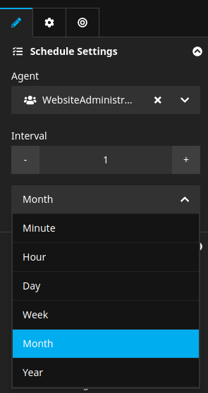

<div align="center">
    <a href="./00_Index.md">Index</a>
</div>

---

# 1. Configuration

Bitzer review tasks can be set up completely via configuration. There are two mixin NodeTypes provided
that can be used by any custom node type that should have review capabilities:
```yaml
'Acme.Site:Document.NewsArticle':
  superTypes:
    'Sitegeist.Bitzer.Review:Mixin.Reviewable': true
    'Sitegeist.Bitzer.Review:Mixin.Setting.Review': true
```
The `Reviewable` mixin flags the node type as reviewable, while the `Setting.Review` mixin provides the necessary properties:



Whenever a node of a node type configured as above is published, a review task will be automatically created
using the selected agent and interval. After the interval has passed, it will appear in Bitzer's
task overview module for the agent and can be activated there. Activation will set the task to state `active`
and redirect the user to the node in the Neos backend view. Once the node is reviewed,
the task can either be manually completed or will be automatically completed when the node is published again,
triggering the creation of a new review task for the future.

---

<div align="center">
    <a href="./00_Index.md">Index</a>
</div>
